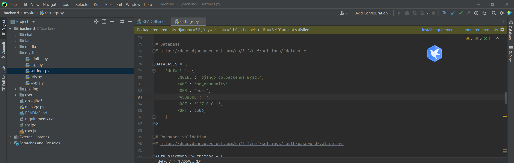
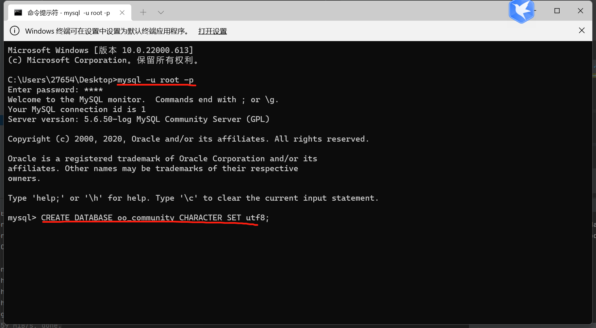
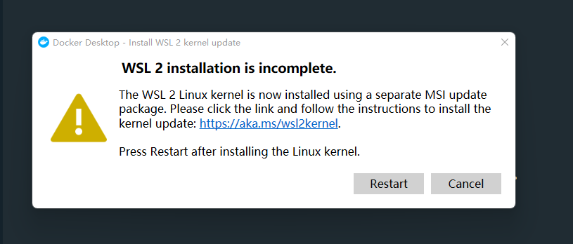

# ChatApp  #


## Architecture ##
 

## Run ##


1. Install requirements
```bash
pip install -r requirements.txt
```
2. Set database mysql.
```
1. install mysql 8.0 (versions >5.6 is ok)
2. Add mysql as environment variable
```
3. Change setting.py in mysite to fit the correct account and password.

4. Create a MySQL database
```sql
CREATE DATABASE oo_community CHARACTER SET utf8;
```

5. Start Redis Server 
```angular2html
1. install docker desktop (for Windows) 4.4.4
Link: https://docs.docker.com/desktop/windows/release-notes/

2. install wsl package following the tips (finish step 4, 5)
```

```bash
docker run -p 6379:6379 -d redis:5
```
6. Init database

```bash
python manage.py migrate
```
7. runserver
```bash
python manage.py runserver
```

##### For step 5,6 if python not environmental variable using pycharm terminal
##### Please use python 3.9 (suggested)